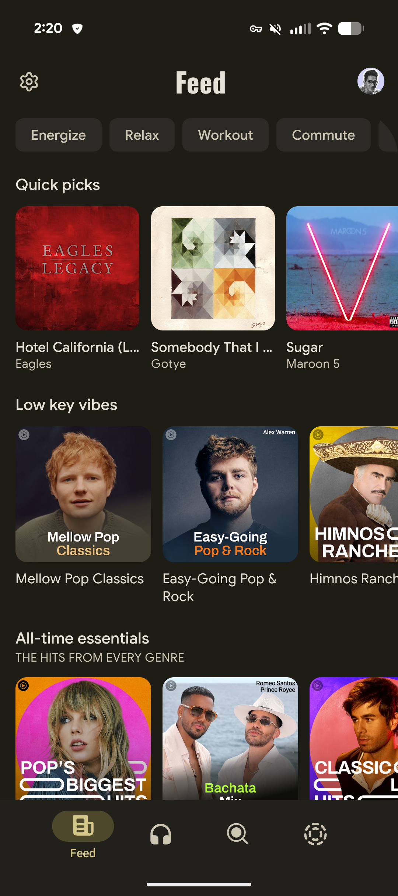
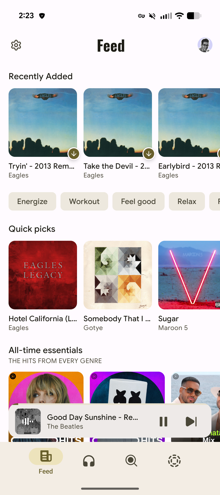
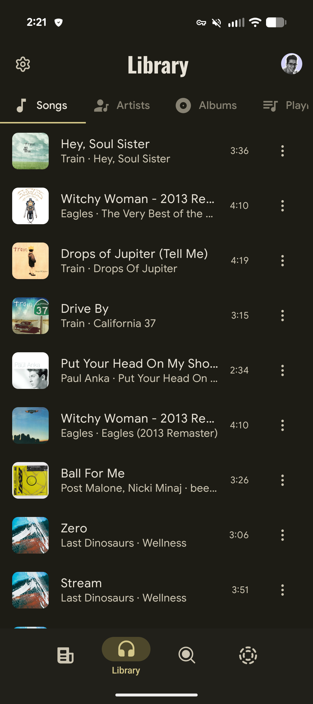
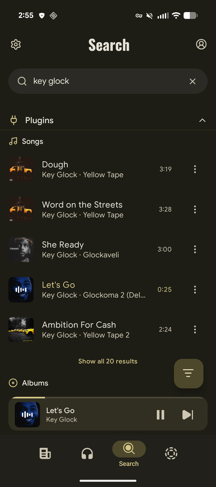
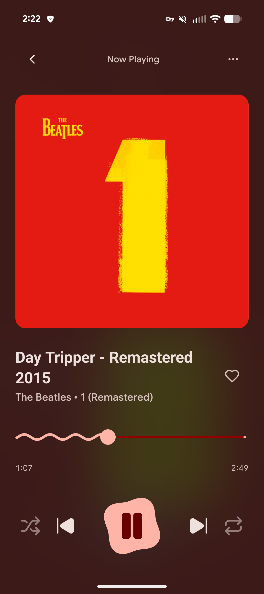
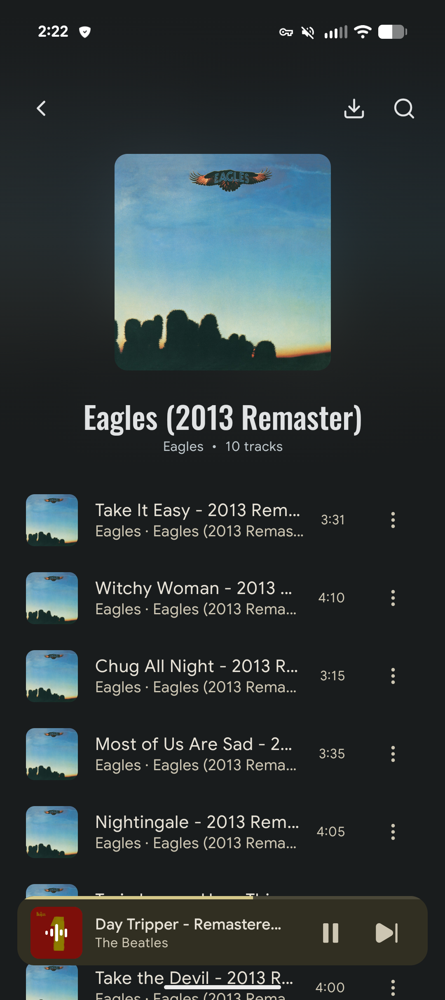
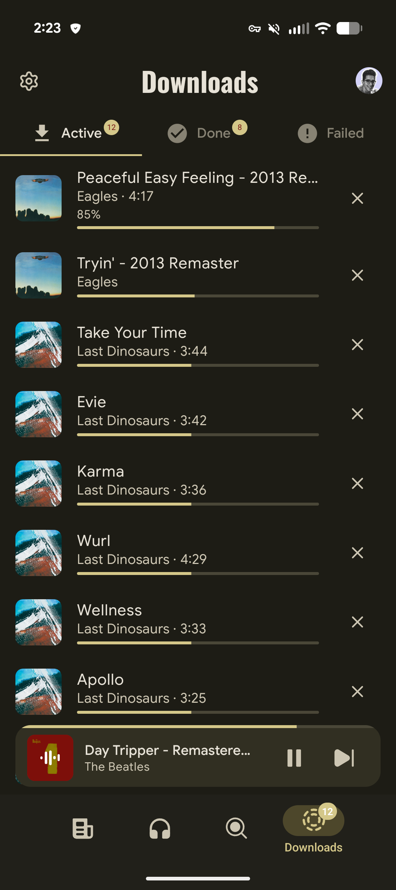

<p align="center">
  
</p>

<h1 align="center">Aria</h1>

<p align="center">
  <strong>A free, open-source, and extensible music player</strong>
</p>

<p align="center">
  
  
  
  
</p>

---

## Features

- **Library Management** — Organize your collection across songs, artists, albums, and playlists.
- **Plugin Architecture** — Extend functionality with first-class metadata and playback providers.
- **Offline Playback** — Listen anywhere, no connection required.
- **Theming** — Light and dark mode with dynamic accent colors.
- **Material 3** — Modern, adaptive UI built on Material You principles.

## Download

Get the latest release from the [Releases](https://github.com/carlelieser/aria/releases) page.

## Screenshots

<p align="center">
  
  
  
  
  
  
  
</p>

## Setup

```bash
git clone https://github.com/carlelieser/aria.git
cd aria
npm install
npx expo start
```

Press `w` to open in browser, or run a native build:

```bash
npm run ios        # Build and run on iOS
npm run android    # Build and run on Android
```

## Build

Builds run **locally** (never on EAS servers). Requires
[EAS CLI](https://docs.expo.dev/eas/) and an authenticated Expo session:

```bash
npm install -g eas-cli
eas login          # or set EXPO_TOKEN

npm run build:android   # → out/aria.apk
npm run build:ios       # → out/aria.ipa
```

Both run `eas build --profile preview --local`. Version numbers come from
`app.json`. See [docs/RELEASING.md](docs/RELEASING.md) for the full release flow
(versioning, artifact verification, and publishing).

## Project Structure

```
app/                   # Screens & navigation (Expo Router)
src/
├── components/        # UI components (organized by domain)
├── hooks/             # React hooks
├── domain/            # Entities & repository contracts
├── application/       # Services & Zustand stores
├── infrastructure/    # Storage & DI
├── plugins/           # Metadata, playback, sync providers
└── shared/            # Utilities
```

See [CLAUDE.md](CLAUDE.md) for architecture details and code standards.

## Releasing

See [docs/RELEASING.md](docs/RELEASING.md) to cut a release (local build +
`gh release create`), and [docs/PUBLISHING.md](docs/PUBLISHING.md) for app store
submission guides (F-Droid, etc.).

## Contributing

PRs welcome. Use [Conventional Commits](https://conventionalcommits.org). See [CLAUDE.md](CLAUDE.md).

## License

[MIT](LICENSE)
